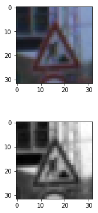
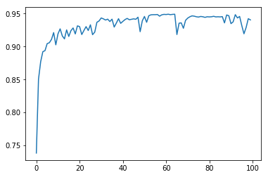
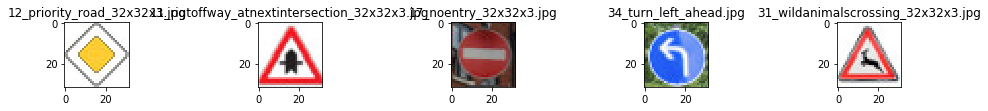

# **Traffic Sign Recognition** 

**Build a Traffic Sign Recognition Project**

The goals / steps of this project are the following:
* Load the data set (see below for links to the project data set)
* Explore, summarize and visualize the data set
* Design, train and test a model arachitecture
* Use the model to make predictions on new images
* Analyze the softmax probabilities of the new images
* Summarize the results with a written report

## Rubric Points
### Here I will consider the [rubric points](https://review.udacity.com/#!/rubrics/481/view) individually and describe how I addressed each point in my implementation.  

---
### Writeup / README

#### 1.This is a README document of the steps taken in detail to accomplish traffic sign recognition.

You're reading it! and here is a link to my [project code](https://github.com/abhilc/TrafficSignClassifier/blob/master/Traffic_Sign_Classifier.ipynb)

### Data Set Summary & Exploration

#### 1. The Data was downloaded from the provided training, test and validation data set pickle files by Udacity. I used the python len function to just capture the length of these data sets

Summary statistics of the data sets are as follows

Number of training examples = 34799
Number of testing examples = 12630
Number of validation examples = 4410
Image data shape = (32, 32, 3)
Number of classes = 43

#### 2. Include an exploratory visualization of the dataset.

Here is an exploratory visualization of the data set. It is a bar chart where X-axis represents 43 unique classes and Y-axis represents the count of images in each class

    

### Design and Test a Model Architecture

As a first step, I decided to convert the images to grayscale because a single channel is sufficient. All that matters to the Covnet is the shape and size of the image regardless of the image being colored or not. 

After grayscaling, I also normalized this image using the formula (pixel - 128)/128. This will result in pixels having values between -1 and +1. This is sufficient for us because these values indicate the intensities of pixels. The below image shows the colored image, and the grayscaled normalized image below it

    

#### 2. Describe what your final model architecture looks like including model type, layers, layer sizes, connectivity, etc.) Consider including a diagram and/or table describing the final model.

My final model consisted of the following layers:

| Layer                  |     Description                                |
|------------------------|------------------------------------------------|
| Input                  | 32x32x1 gray scale image                       |
| Convolution 5x5        | 1x1 stride, valid padding, outputs 28x28x6     |
| RELU                   |                                                |
| Max pooling            | 2x2 stride,  outputs 14x14x6                   |
| Convolution 5x5        | 1x1 stride, valid padding, outputs 10x10x16    |
| RELU                   |                                                |
| Max pooling            | 2x2 stride,  outputs 5x5x16                    |
| Flatten                | outputs 400                                    |           |                                                |
| Fully connected        | outputs 120                                    |
| RELU                   |                                                |
| Fully connected        | outputs 84                                     |
| RELU                   |                                                |
| Fully connected        | outputs 43                                     |
| Softmax                |                                                |
 

#### 3. Training the model

To train the model, I used the following Hyperparameters

EPOCHS 100
BATCH_SIZE 128

My final model results were:
* training set accuracy of 99.3%
* validation set accuracy of 93.6%
* test set accuracy of 92.7%

    

An iterative approach was chosen 
* The architecture of the model is a well known architecture initially proposed by Yann Lecun called LeNet. A schematic of the architecture is as below

    

* Although the architecture is well known, I had to tune the hyperparameters manually to and run the training set several times so that the desired accuracy is achieved
* Underfitting: With only 50 EPOCHS and no preprocessing of the training images, the overall training accuracy achieved was around 80% for training set and 60% for validation set
* Then, using the numpy library the images were converted to grayscale. The shape of the images after conversion were 32x32x1. The 3 channel RGB was converted to a single channel
* I also normalized the images using (pixel - 128)/128. This converted the pixel values to range between -1 and 1. These could be interpreted as intensities of each pixel
* After the mentioned improvements the validation set accuracy was improved to around 91% which was still not enough to satisfy the project requirements
* As last steps I only increased the EPOCHS to 100, and plotted the validation accuracy against EPOCHS. The average accuracy across all batches was improved to 93.2%
* As the training set, test set and validation set accuracies are closer to each other, we can say that the model behavior is not random and it has trained well. 
 

### Testing the Model on new images 

#### 1. I downloaded 5 images from the web. 

Here are five German traffic signs that I found on the web:

    

All the images were classified correctly

The results of the prediction is in the 23rs cell of the Jupyter Notebook

The model was able to correctly guess 5 of the 5 traffic signs, which gives an accuracy of 100. This compares favorably to the accuracy on the test set of 92%

#### 3. Describe how certain the model is when predicting on each of the five new images by looking at the softmax probabilities for each prediction. Provide the top 5 softmax probabilities for each image along with the sign type of each probability. (OPTIONAL: as described in the "Stand Out Suggestions" part of the rubric, visualizations can also be provided such as bar charts)

The code for making predictions on my final model is located in the 17th cell of the Ipython notebook.

For the first image, the top 5 softmax probabilities were

The results of the top 5 softmax probabilities for all the images is shown below:

[[12  9 15 35 14]  
 [11 30 28 21 26]  
 [17 26 14 20  9]  
 [34 12 35 38 15]  
 [31 19 21  0  1]]  
[[  1.00000000e+00   4.47849316e-15   5.47429825e-18   9.23054507e-24
    1.12758940e-24]
 [  1.00000000e+00   3.47031146e-21   5.43381315e-32   4.83433513e-32
    1.40583273e-37]
 [  1.00000000e+00   1.82921509e-20   1.20678815e-21   1.71519742e-22
    9.63574600e-23]
 [  1.00000000e+00   2.73031343e-17   3.40219531e-18   2.12394504e-18
    1.60944370e-20]
 [  1.00000000e+00   8.99465318e-34   2.54050115e-38   0.00000000e+00
    0.00000000e+00]]

The array's first value shows the predictions in the decreasing order of their probabilities for each image. As we can see, the 1st column of the first value of the above array correspond to the 1st column of the second value of the array, which are nearly 100%. 

## Scope for further improvements
1. The learning rate and the EPOCHS could further be adjusted to get a better accuracy
2. More hyperparameters such as dropouts, 1x1 convolutions, could be introduced to improve performance and faster learning
3. Introduction of more fully connected convlutions as intermediate layers could further improve performance 

